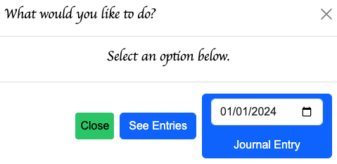

# Dear Diary
#### Video Demo:  <https://www.youtube.com/watch?v=AFAwsm2GZf8>
#### A flask web application intended for private Diary entries..:

# CS50 Final Project - Dear Diary

'Dear Diary' is a flask web application that allows users to submit entries into their own private digital Diary.

## Requirements
In order to design the application, I narrowed the possibilities down to the following requirements.

* Ability to register for a secure account so that entries are not public
* Aility to log into my account
* Ability to log out of my account
* Ability to type and submit a journal entry
* Ability to associate my journal entry to a date
* Ability to find and read existing journal entries based on timeframe
* Ability to edit an existing journal entry

## File Explanations

1.  static
    - styles.css
        - contains all the styling for html elements. Extremely important for Dear Diary functionality
    - timeline.js
        - where all the custom js scripts reside (other than the hover and modal scripts that reside in [hztimeline.html](project/templates/hztimeline.html) )
        - scripts
            - greensock animation scripts for animating the the months and years that fly into the homescreen
            - greensock animation scripts for animating the horizontal scrolling effect on the "scrollMy" page
            - script to re-open and set values in the bootstrap modal that closes when the datepicker is opened from within the modal
            - script to help with dates needed for displays and for setting page values that app.py will use in logic and in sqlite queries
2. Templates
    - apology.html
        - page rendered to users when approute function needs to return an error message
    - entries.html
        - tabular representation of existing journal entries
    - entry.html
        - input form where journal entries are submitted
    - hztimeline.html
        - horizontal display of years with respective months where user can navigate to a list of entries or can submit an entry for a given month, year
    - layout.html
        - static layout that contains navigation and main container for all dynamically rendered templates
    - login.html
        - page for registered users to login
    - register.html
        - page for unregistered users to register
    - scrollmy.html
    - page for optional horizontal, scrolling based, view of their entries
3. app.py
    - contains all python logic for application routing
4. helpers.py
    - contains python functions needed for specific conditional handling within application.
5. project.db
    - sqlite db where users and their entries are stored
6. requirements.txt
    - list of packages and libraries needed for application to work
7. Screenshots of the app used in Read.ME file
8.  Read.ME file with details

## Application Overview

1. ### Logging in and Registering
    - Visitors are directed to a login page by default. Those that have accounts can login. Those that don't can register with username, password and by confirming password

    | Register | Login |
    | :---: | :---: |
    |  |  |
2.  ### Home Page and Navigation
    - The Home Page asks user to scroll. Scrolling will animate the positions of boxes for years and underlying months
    - Navigation Bar contains clickable links to app routes that render the [Html Templates](#templates)
    -   Selecting a month will open a modal with options
     | Home | Modal View |
    | :---: | :---: |
    |  |  |
3. ### Journal Entry
    - The Journal Entry Page renders an open text form with placeholder text if it's a brand new entry Or contains the existing Entry if an edit was requested
    - Users are routed here from the "Log Today's Entry" navigation link. #The Date will default to Today's Date
    - Users are routed here from the "Journal Entry" button within the Modal that pops up when users select a month on the home page. #The Date will default to the first day of the month in the year for which user selected.
     | Journal Entry |
        | :---: |
    |  |
4. ### See History
    - There are a few options for this.
        - "See Entries" navigation link sends user to a tabular view of all existing entries
        - "See Entries" button embedded in the modal that pops up when clicking on a month box on the home page takes user to a tabular list for entries only within that month
        - "Scrollmy" navigation link takes user to page that allows horizontal scrolling of all entries. This is controlled with a custom script written within the Green Sock Scroll Trigger plugin.
         | Scroll Through| Tabular View |
    | :---: | :---: |
    |  |  |
5. ### Edit Entry
    - Entries can be edited from either of the History Page Options.
     | Pre Edit | Editing | Post Edit |
    | :---: | :---: | :---: |
    |  | |  |

## Design Choices, Challenges and lessons
- Abandoned initial idea
    - The initial idea was that a traditional looking, horizontal timeline would be the center of the user experience. The idea was that they'd be able to scroll and/or zoom to render points in time where they'd like to enter a diary entry or see a marker/preview of previous entries. With the challenges I ran into with styling, positioning and sizing, I ended up abandoning that concept for an MVP that's a bit simpler. However, while researching the animated effect that I initially wanted, I stumbled upon some awesome examples developed with GSAP ScrollTriggers. Because I wanted to demonstrate something a bit new and outside the specifics covered in the course, I rigorously worked with the GSAP plugin to create some pretty cool effects.

- Python, Javascript, Jinja, Flask, JQuery, CSS, HTML, SQL,??
    - This project really forced me to tackle things based on moveable requirements. I found myself referring to material to determine what would best solve for a given requirement. Sometimes I found that CSS was a better solution for something I assumed HAD to be handled with JS or Python. Other times I found that a solution had to be broken into parts and orchestrate the implementation of every single above language. An Example is the challenge of allowing a user to select an element like month, from the homepage, listen for the event with Javascript, insert a value into an html form and execute python logic via flask app routing.

- Styling is more important than I thought
    - I ran into a lot of issues trying to implement the user experience I wanted, simply due to limited knowledge of css. Thanks to the course, I was able to get the inertia needed to delve deeper into styling and how it be leveraged to create incredible functionality, and not just look and feel. I learned quite a bit about Flexboxing, Transformations, Sizing, Positioning, Visibility. Because my ScrollTriggers are dependent on these, I was forced to understand them and use them in more deliberate ways for more complex experiences.

# Top 5 solutions that I almost gave up on

## The Home Page Functionality
- GSAP scroll animations that bring in years and months from out of view window and into position.
- Hover effects on the months could not be done with CSS alone since GSAP Animations essentially pause those so that animations can take place and finish.
- Clicking on a month sets a default date in both the Date Picker Element and in the "See Entries" button that will be used in the follow up actions
- Re-opening the Bootstrap modal after a date selected and inserting the selected date in the input parameter required javascript event listeners

## The Horizontal Scrub based Scroll of Entries
- This was a challenge because the table rows of the tabular view of history didn't seem to want to work.I needed to create a new page that loaded entries with Jinja into a div. Then I needed to calculate the vertical scroll distance such that it allowed for the final entry to land center of the screen.

### References to other plugins and learning material
- [GSAP Greensock ScrollTrigger Plugin](https://gsap.com/docs/v3/Plugins/ScrollTrigger/)
- [Bootstrap Modal 5.0](https://getbootstrap.com/docs/5.0/components/modal/)
- [Boostrap Navbar](https://getbootstrap.com/docs/5.0/components/navbar/)

